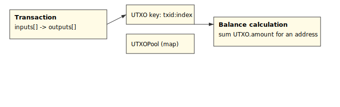
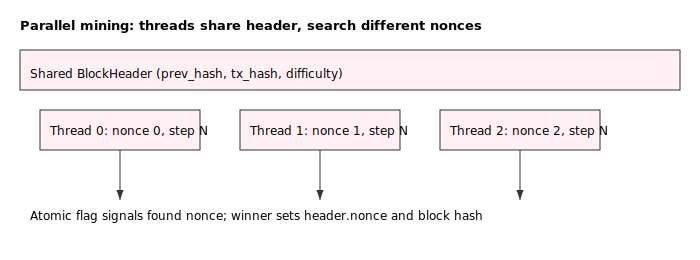

# Supaprastinta blokų grandinė

## Santrauka
- Įvestis: sugeneruotos transakcijos, vartotojų sąrašas, difficulty, tpb (tx per block).
- Išvestis: lokali grandinė (blockchain), log'ai apie kasimą ir blokus.
- Sėkmės kriterijus: programa kompiliuoja, vyksta PoW kasimas, blokai pridedami ir konsolėje matosi taikytos transakcijos.

## Ką realizuoja `main.cpp`

- HashFunkcija: programoje yra paprasta, custom maišos funkcija `HashFunkcija(std::string)` naudojama tiek transakcijų ID, tiek blokų hašams.
- UserManager: sugeneruoja vartotojus ir pradinius balansus (kiekvienam vartotojui sukuriamas vienas funding UTXO).
- Transaction + UTXO
  - `Transaction` naudoja `TxInput`/`TxOutput` struktūras (UTXO stiliaus įėjimai/išėjimai).
  - Kiekviena transakcija turi `computeId()` ir `verifyId()` (ID = `HashFunkcija(serialiseCanonical())`).
  - `UTXOPool` saugo dabartinius nepanaudotus išėjimus ir teikia add/get/remove operacijas.
- TxPool: laukiančių transakcijų saugykla su paprasta atsitiktine paėmimo logika (`take`).
- Block/BlockHeader
  - `BlockHeader` laukai: prev_hash, transactions_hash (Merkle root), nonce, timestamp, difficulty.
  - `Block::computeTransactionsHash` realizuoja Merkle medžio skaičiavimą.
- Miner
  - `Miner::makeCandidate` sukuria kandidatą (prideda coinbase tx ± pasirinktas transakcijas iš `TxPool`).
  - `Miner` turi tris kasimo metodus: `mine()` (single-thread), `tryMine()` (su limitais), `tryMineParallel()` (paprastas dauggijis sprendimas per `std::thread`).
- Blockchain
  - `Blockchain` inicializuoja genesis bloką, laiko vektorių `chain_` ir teikia `addBlock(const Block&, UTXOPool&)`.
  - `addBlock` tikrina: prev_hash, PoW (starts_with_zeros), bei perskaičiuoja `transactions_hash` (Merkle root). Taip pat atlieka UTXO-validaciją ir atnaujina `UTXOPool`.
- Main programos srautas
  - Generuoja vartotojus ir funding UTXO'us, sugeneruoja transakcijas (`generateTransactions`), ir vykdo kasimo ciklą:
    - sudaro kandidatų rinkinį,
    - bando iškasti kiekvieną kandidatą su `tryMineParallel`,
    - kai randamas galiojantis blokas, netaikyti tx grąžinami į pool'ą ir rastas blokas pridedamas prie grandinės per `Blockchain::addBlock`.

## Transakacijų, UTXO modelio, Merkle root, Lygiagretaus kasimo aprašymai

Žemiau pateikiu detalesnius aprašymus ir trumpus kodo fragmentus

1) Transaction (serializacija ir ID)

```cpp
std::string Transaction::serialiseCanonical() const {
  std::string s;
  s += to_string(timestamp_) + "|";
  s += to_string(inputs_.size()) + ";";
  for (const auto& inp : inputs_) {
    s += inp.prevTxId + "," + std::to_string(inp.outputIndex) + ";" + inp.senderPubKey + ";";
  }
  s += std::to_string(outputs_.size()) + "|";
  for (const auto& outp : outputs_) {
    s += outp.receiventPubKey + "," + std::to_string(outp.amount) + ";";
  }
  return s;
}

void Transaction::computeId(){
  id_ = HashFunkcija(serialiseCanonical());
}
```
Paaiškinimas: ID generuojamas deterministiškai iš canonical serializacijos. `verifyId()` perskaičiuoja tą patį ir leidžia atpažinti klastojimą.

2) Merkle root (Block::computeTransactionsHash) — faktinis kodas

```cpp
static string Block::computeTransactionsHash(const vector<Transaction>& txs) {
  if (txs.empty()) return HashFunkcija("");
  vector<string> layer; for (const auto& t : txs) layer.push_back(t.getId());
  while (layer.size() > 1) {
    if (layer.size() % 2 == 1) layer.push_back(layer.back());
    vector<string> next; next.reserve(layer.size() / 2);
    for (size_t i = 0; i < layer.size(); i += 2) next.push_back(HashFunkcija(layer[i] + layer[i+1]));
    layer.swap(next);
  }
  return layer.front();
}
```

3) UTXOPool pagrindinės operacijos (add/get/remove)

```cpp
void UTXOPool::add(const string& txid, uint32_t index, const TxOutput& out) {
  map_[key(txid,index)] = out;
}
bool UTXOPool::get(const string& txid, uint32_t index, TxOutput& out) const {
  auto it = map_.find(key(txid,index)); if (it == map_.end()) return false; out = it->second; return true;
}
bool UTXOPool::remove(const string& txid, uint32_t index) {
  return map_.erase(key(txid,index)) > 0;
}
```

4) Miner parallel snippet (pagrindinė idėja)

```cpp
 per-thread: localNonce = base + tid; while (!found) { hdr.set_nonce(localNonce); h = HashFunkcija(hdr.to_string()); if (meetsDifficulty(h)) { set found } localNonce += threadCount; }
```

## Išsamūs klasės ir funkcijų aprašymai

Žemiau pateikiami išsamūs aprašymai visoms reikšmingoms klasėms ir pagalbinėms funkcijoms, kurios yra `main.cpp`. Kiekvienam objektui nurodau laukus, pagrindinius metodus.

- HashFunkcija(std::string tekstas)
  - Tipas: funkcija
  - Paskirtis: custom maišos funkcija, naudojama transakcijų ID ir blokų hash apskaičiavimui.
  - Savybės: grąžina heksadinę eilutę ilgumo 64 (pagal `HASH_DYDIS=32`), nėra kriptografiškai saugi.
  - Edge cases: priima bet kokį string; tuščias stringas grąžina specifinį hash (naudojamas genesis/tuščiam Merkle).

- Logger
  - Tipas: struct su statiniais metodais
  - Metodai: `info(const string&)`, `warn(const string&)`, `dbg(const string&)`, `summary(const string&)`
  - Paskirtis: supaprastinta konsolės logika; nenaudoja lygio filtravimo.

- User
  - Tipas: klasė
  - Laukai: `name_`, `publicKey_`, `balance_` (long long)
  - Metodai: `deposit(long long)`, `withdraw(long long)`, getteriai `getName()`, `getPublic_key()`, `getBalance()`
  - Paskirtis: laikyti vartotojo duomenis ir balansą (naudojama pradiniam fundingui).
  - Edge cases: `withdraw` grąžina false jei suma > balance.

- TxInput
  - Tipas: struct
  - Laukai: `prevTxId` (string), `outputIndex` (uint32_t), `senderPubKey` (string), `signature` (string)
  - Paskirtis: nuoroda į anksčiau sukurtą UTXO ir (vietoje) parašas.
  - Pastaba: `signature` laukas šiuo metu tuščias generuojant tx, todėl nėra autentifikacijos.

- TxOutput
  - Tipas: struct
  - Laukai: `receiventPubKey` (string), `amount` (long long)
  - Metodai: `serialize()` — gražina "pubkey:amount"
  - Paskirtis: apibrėžia transakcijos išėjimą / naują UTXO.

- Transaction
  - Tipas: klasė
  - Laukai (privatūs): `id_` (string), `timestamp_` (uint64_t), `inputs_` (vector<TxInput>), `outputs_` (vector<TxOutput>)
  - Vieši metodai: konstruktorius, `getId()`, `getTimestamp()`, `getInputs()`, `getOutputs()`, `serialiseCanonical()`, `computeId()`, `verifyId()`
  - Paskirtis: modeliuoti transakciją UTXO modelyje.
  - Svarbu: `serialiseCanonical()` ir `computeId()` užtikrina, kad `id_` yra deterministinis ir gali būti patikrintas su `verifyId()`.
  - Edge cases: jei inputs ar outputs tušti, serializacija vis tiek generuoja deterministinį stringą; `verifyId()` būtinas, kai taikome tx į UTXOPool.

- UTXOPool
  - Tipas: klasė (paprasta UTXO saugykla)
  - Laukai: `unordered_map<string, TxOutput> map_` kur raktas = `txid:index`
  - Metodai: `add(txid,index,out)`, `exists(txid,index)`, `get(txid,index,out)`, `remove(txid,index)`, `listKeys()`
  - Paskirtis: valdyti šiuo metu nepanaudotus UTXO.
  - Edge cases: `parseKey` padeda atskirti txid ir index; `remove` grąžina false jei įrašas neegzistuoja.

- UserManager
  - Tipas: klasė
  - Laukai: `unordered_map<string, User> users_`, RNG
  - Metodai: `generateUsers(n)`, `withdraw(pk, amt)`, `deposit(pk, amt)`, `keys()`, `all()`
  - Paskirtis: sukurti vartotojus su pradiniu balansu; suteikia paprastus API balansų keitimui (naudinga testavimui ir funding UTXO kūrimui).

- TxPool
  - Tipas: klasė
  - Laukai: `vector<Transaction> pending_`, RNG
  - Metodai: `push(Transaction)`, `take(maxCount)`, `size()`
  - Paskirtis: laikyti laukiantį mempool; `take` paima atsitiktinį rinkinį transakcijų

- BlockHeader
  - Tipas: klasė
  - Laukai: `prev_hash_` (string), `timestamp_` (uint64_t), `version_` (string), `transactions_hash_` (string), `nonce_` (uint64_t), `difficulty_` (unsigned)
  - Metodai: setteriai/getteriai, `to_string()` (surenka antraštės laukus į stringą, kuris naudojamas hashinimui)
  - Paskirtis: talpina bloko metaduomenis, kurie yra PoW objektas.

- Block
  - Tipas: klasė
  - Laukai: `BlockHeader header_`, `vector<Transaction> transactions_`, `string block_hash_`
  - Metodai: `header()`, `transactions()`, `block_hash()` getteriai/setteriai, `computeTransactionsHash()`
  - Paskirtis: bloko konteineris; saugo transakcijas ir antraštę.

- Miner
  - Tipas: klasė
  - Laukai: `difficulty_`, `minerPub_`, `reward_`
  - Metodai: `makeCandidate(prevHash, difficulty, txPerBlock, pool)`, `tryMine(block, timeLimitMs, maxAttempts)`, `tryMineParallel(block, timeLimitMs, maxAttempts, threadCount)`, `mine(block)`
  - Paskirtis: kurti bloko kandidatus (įtraukti coinbase tx), vykdyti PoW kasimą (viena / ribota / paralelinė strategija).
  - Edge cases: `tryMineParallel` apribojamas iki 8 threads; naudojami atomikai ir mutex'ai rezultatų saugumui.

- Blockchain
  - Tipas: klasė
  - Laukai: `vector<Block> chain_`, `unsigned difficulty_`
  - Metodai: konstruktorius (sukuria genesis), `tip()`, `height()`, `addBlock(const Block&, UTXOPool&)`
  - Paskirtis: saugoti visą grandinę, validuoti blokus (prev_hash, PoW, Merkle root), pritaikyti transakcijas prie `UTXOPool`.
  - Edge cases: `addBlock` atmeta blokus su neteisingais prev_hash arba transactions_hash, taip pat neleidžia taikyti transakcijų, kurių inputs neegzistuoja arba outputs > inputs.

- Pagalbinės funkcijos
  - `starts_with_zeros(hexHash, zeros)` — patikrina ar heksadekadinis stringas prasideda `zeros` nuliais; naudojama difficulty patikrai.
  - `nowSec()` — grąžina dabartinį laiką sekundėmis (naudojama timestampams transakcijoms/blokams).


## UTXO modelis — kaip jis įgyvendintas main.cpp ir pagrindiniai trūkumai

Kaip įgyvendinta
- `main.cpp` naudoja UTXO modelio elementus: `TxInput` / `TxOutput`, `Transaction` su įėjimais/išėjimais, ir `UTXOPool` kaip pagrindinę UTXO saugyklą.
- Transakcijų generavimo dalyje (`generateTransactions`) dažniausiai kuriamos vieno-input transakcijos (paimamas vienas atsitiktinis UTXO, dalis siunčiama kitam vartotojui, likutis — change atgal siuntėjui).
- `Blockchain::addBlock` patikrina, ar visi inputs egzistuoja `UTXOPool` ir ar sumos sutampa, tada pašalina panaudotus UTXO ir prideda naujus outputs.



Pagrindiniai trūkumai / apribojimai

- Signatūros nėra taikomos: `TxInput.signature` laukas egzistuoja, bet transakcijos generavimo metu jis paliekamas tuščias — nėra kriptografinės parašų validacijos. Tai reiškia, kad nėra tikros autentifikacijos, kas gali vykdyti transakcijas.
- Mempool / fee politika: nėra transakcijų mokesčių prioritetų — blokams atrenkamos transakcijos atsitiktinai iš pool, todėl nėra realistiškos rinkos-dinamikos.
- Neišsaugojimas / neperdavimo galimybės: UTXO pool nėra serializuojamas / išsaugomas į diską — nėra persistencijos ar checkpoint'ų.

## Kasybos (mining) — trūkumai / apribojimai implementacijoje

Kaip įgyvendinta
- `main.cpp` naudoja PoW (Proof-of-Work) modelį: bloko hash'as apskaičiuojamas kaip `HashFunkcija(block.header().to_string())`, o galiojimas tikrinamas per `starts_with_zeros(h, difficulty)` (ieškoma tam tikro skaičiaus pirmųjų '0' simbolių heksadinėje eilutėje).
- `Miner` turi viengiją ir paprastą dauggijų (`tryMineParallel`) implementaciją: gijos iteruoja per nonce reikšmes su žingsniu lygų `threadCount`.



Trūkumai / apribojimai

- Nėra dinaminio difficulty reguliavimo: difficulty yra fiksuotas per vykdymą, nėra automatinio pritaikymo prie kasybos greičio.
- Nėra tinklo konsensuso / reorg handling: programa yra centralizuota vienoje instancijoje, nėra mechanizmo spręsti konflikto situacijas tarp kelių node'ų ar šakėms.
- Blokų atmetimas / orphan handling nėra simuliuotas: nėra mechanizmo valdyti atskirų mined blokų konflikto tarp kelių mazgų.


## Kaip sukompiliuoti ir paleisti (Windows PowerShell)
1) Reikalavimai:
 - G++ (MinGW) arba patogi C++ kompiiliavimo grandinė. Alternatyva: Visual Studio / MSVC (reikia adaptuoti komandas).

2) Kompiliacija su g++ (PowerShell):

```powershell
g++ -std=c++17 -O2 main.cpp -o blockchain.exe
```

Jei naudojate MinGW, galite gauti `blockchain.exe`.

3) Paleidimas (pavyzdys):

```powershell
# Paleisti su numatytais parametrais
.\blockchain.exe

# Greitas testas su mažesniu difficulty
.\blockchain.exe --difficulty 2 --max-blocks 3

# Pvz., su daugiau vartotojų ir transakcijų
.\blockchain.exe --difficulty 3 --users 100 --tx 500 --tpb 50 --max-blocks 5
```

## Greitas pavyzdys: kasimo eiga (ką matysite konsolėje)
- "Mining block #1, nonce=..." — spaudžiama informacija apie nonce bandymus
- "FOUND block hash=... nonce=..." — rastas galiojantis hash
- "APPLIED tx X" / "SKIPPED tx Y" — ar transakcija buvo pritaikyta bloko metu

---

## CLI flag'ai (komandinės eilutės parametrai)
Žemiau pateikti dažniausiai naudojami flag'ai, kaip jie gali būti perduodami per konsolę ir paprasti C++ pavyzdžiai kaip juos apdoroti.

Rekomenduojami flag'ai (projekto CLI):
- `--difficulty <n>` — nustato PoW difficulty (skaičius: kiek pirmų hex simbolių turi būti '0').
- `--users <n>` — sugeneruoti `n` vartotojų.
- `--tx <n>` — sugeneruoti `n` transakcijų (bendras skaičius per visą simuliaciją).
- `--tpb <n>` — transakcijos per bloką (tx per block).
- `--max-blocks <n>` — maksimalus iškasti blokų skaičius (naudinga testavimui).
- `--threads <n>` — maksimalus gijų skaičius paraleliam kasimui.
- `--help` — atspausdinti pagalbą.

## AI įrankio naudojimas ir ką jis pasiūlė (apibendrinimas)

Šiame projekte buvo naudotas AI kaip pagalbinė priemonė architektūros pasiūlymams, kodo realizavimui, nes kartais galvoje veinas dalykas, o kode gaunasi kitas. Žemiau trumpai aprašau, kur AI padėjo ir kokius kodo tobulinimo pasiūlymus galima įgyvendinti.

Kur AI padėjo:
- CLI įgyvendime, pilnai paaiškino ir parašė kaip ir ką reikia realizuot
- UTXO modelio integravimą į transakciją, pataisė pačio modelio realizaciją
- Pateikė `hints` kaip galima įterpti lygiagretų programavimą į bloko kasimą, parašė pagrindą
- Pateikė pasiūlymus kaip galima parašyti blokų kasimą ir realizuoti genesis bloką su COINBASE reward.

Rekomenduojami kodo tobulinimai (AI pasiūlymai, kurie būtų naudingi implementuoti):
- UTXO modelio patobulinimai:
  - Įgyvendinti parašus (ECDSA / Ed25519) transakcijoms, kad `TxInput.signature` būtų validuojamas prieš pritaikant tx į UTXOPool.
  - Pridėti UTXO persistenciją (paprastas file dump / JSON arba LevelDB/SQLite), kad testai būtų reprodukuojami.
  - Fee/priority mechanizmas mempool'e: pridėti `fee` laukas `TxOutput`/`Transaction` ir pasirinkimo logiką `TxPool::take`.

- Lygiagretus kasimo tobulinimas:
  - Naudoti thread pool arba work-stealing (vietoj paprasto per-stepping nonce) ir saugų atomic flag'ą "found".
  - Apsvarstyti dynamic range partitioning arba per-blok nonce base randomizaciją, kad gijos neperliptų vienos kitos darbo.
  - Užtikrinti deterministic logging / per-gijų rezultato sutvarkymą (kas tas, kuris pritaiko bloką ir atšaukia kitus rezultatų bandymus).


